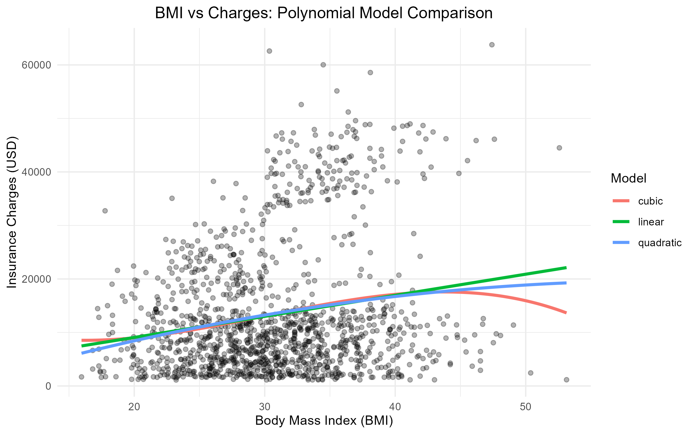

# Project 5 — Polynomial Regression & Non-Linear Relationships (Insurance Dataset)

## 📌 Project Goal  
Learn how to model **non-linear relationships** in regression using **polynomial terms**.  
The focus is on **methodology and model comparison**, not on clinical or predictive inference.

## 📊 Dataset  
- Source: `insurance.csv`  
- Variables used in this project:  
  - `charges` (Insurance charges in USD)  
  - `age` (Years)  
  - `bmi` (Body Mass Index)  
  - `sex`, `smoker`, `region`, `children` (available but not main focus here)  

## 🧪 Analysis Overview  
- Data quality checks (`glimpse`, `summary`, missing values)  
- Convert categorical variables to factors  
- Exploratory Data Analysis (EDA):  
  - Scatter plots: Age vs Charges  
  - Scatter plots: BMI vs Charges  
  - Comparison between linear fit and LOESS curve  
- Polynomial regression models:  
  - Linear (baseline)  
  - Quadratic (x + x²)  
  - Cubic (x + x² + x³)  
- Model comparison using:  
  - R² & Adjusted R²  
  - AIC, BIC  
  - ANOVA (nested models)  
- Combined polynomial model (age² + bmi²)  
- Diagnostic plots (residuals, QQ plot, Cook’s distance)  
- Demonstration of overfitting (degree-10 polynomial)  

## 📈 Key Findings  
- Some curvature observed in Age and/or BMI relationships  
- Quadratic models may slightly improve R² compared to linear models  
- Cubic models rarely provide meaningful additional improvement  
- High-degree polynomials increase R² but worsen AIC/BIC → evidence of overfitting  
- Improvement in explained variance is generally modest  

## 🧠 Key Concepts Demonstrated  

### 📌 Polynomial Terms  
- Linear model assumes constant slope  
- Quadratic term (x²) allows curvature  
- Cubic term (x³) allows more complex shape  
- `I(x^2)` in R ensures proper mathematical interpretation  

### 📌 Model Comparison  
- R² always increases with more terms  
- Adjusted R² penalizes unnecessary complexity  
- AIC & BIC help balance fit vs simplicity  
- ANOVA tests whether added polynomial terms significantly improve fit  

### 📌 Overfitting  
- High-degree polynomials can fit noise rather than signal  
- Better in-sample R² does **not** guarantee better generalization  
- Always compare adjusted R², AIC, and BIC  
- Simpler models are often preferable  

### 📌 Diagnostic Evaluation  
- Residual patterns  
- Normality of residuals  
- Homoscedasticity  
- Influential observations (Cook’s distance)  

## 🖼️ Visualization  
- Linear vs LOESS comparison plots  
- Polynomial curve overlays (linear, quadratic, cubic)  
- Combined model comparison  
- Diagnostic plots  

## 📌 Conclusion  

This project serves as a **methodological exercise** in extending linear regression to capture non-linear patterns:

- Polynomial regression allows flexible modeling of curvature.  
- Small improvements in R² do not always justify added complexity.  
- Overfitting is a real risk when degree becomes too large.  
- Model selection should prioritize interpretability and generalizability.  

> Key takeaway: Polynomial regression is powerful but must be used carefully — simplicity often wins unless curvature is clearly justified.
